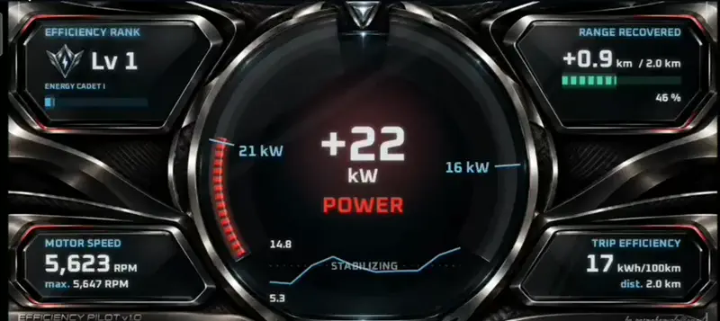
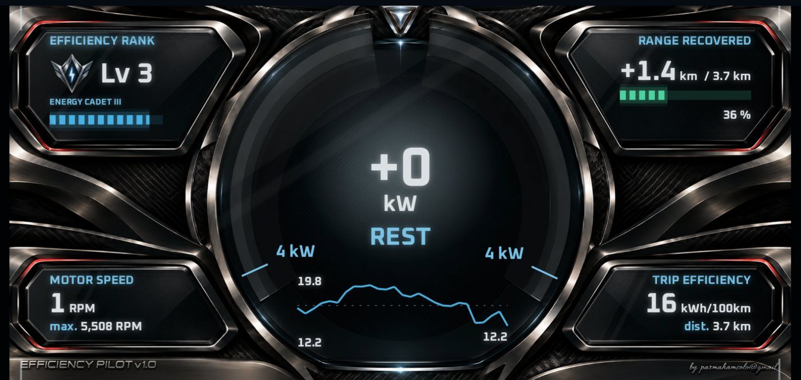
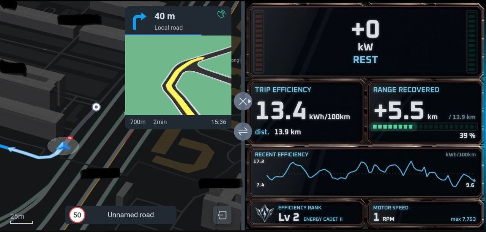
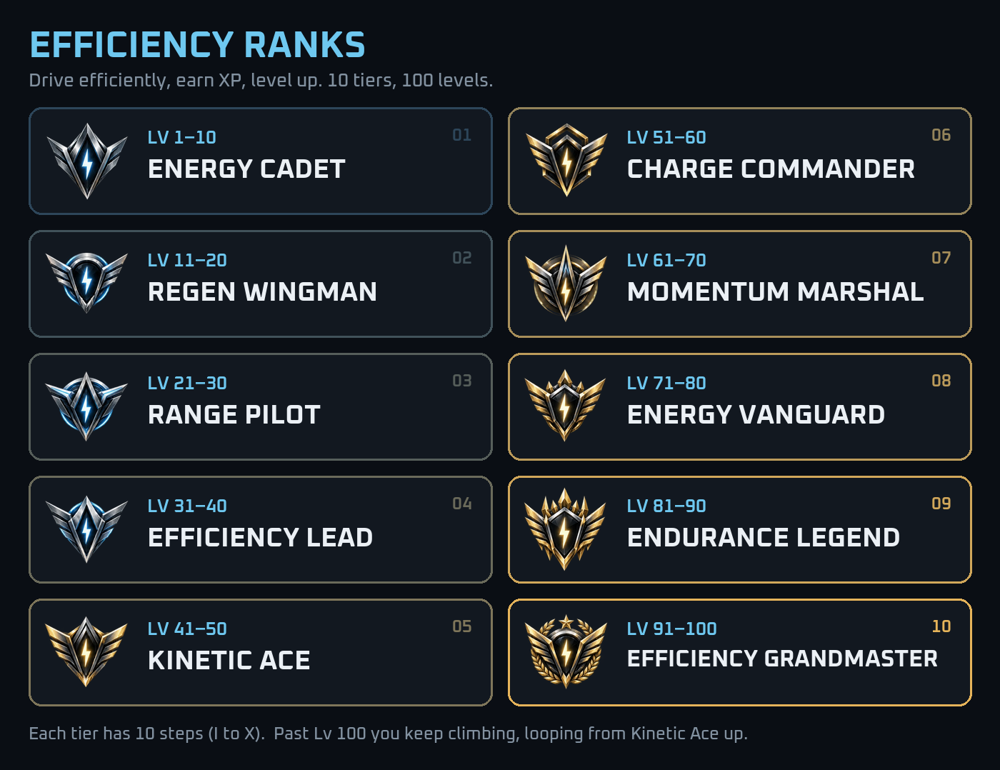

# Efficiency Pilot

**A live efficiency dashboard for the BYD Sealion 7 (DiLink 5).**
Big numbers, live feedback, and a rank progression to keep it fun.

  

  <b><a href="../../releases/latest">⬇ Download the latest APK</a></b>
  &nbsp;·&nbsp; Free &nbsp;·&nbsp; No account &nbsp;·&nbsp; No ads

---
 
 

## Why this one?

Most apps throw a wall of charts at you. Tiny fonts, heavy text, ten graphs you'll never read
while driving. Yawn.

Efficiency Pilot goes the other way:

- **Simple.** A few big numbers you can read in a glance. Nothing to dig through.
- **Live.** Press the pedal, watch it go red. Lift off, watch it go green. You *feel* what's
  costing you range, the moment it happens.
- **Fun.** Drive smoothly, earn XP, rank up. It turns saving energy into a little game.

The idea: you don't learn efficient driving from a report after the trip. You learn it from
instant feedback while you drive.
 
 

## What's on screen

| | |
|---|---|
| ⚡ **Power / regen gauge** | Red = using power. Green = getting energy back. |
| 📊 **Trip efficiency** | Your kWh/100km for this trip. |
| 🔋 **Range recovered** | How many km regen has given back. |
| 📈 **Recent efficiency** | A small rolling line, so you see if you're getting better. |
| 🌀 **Motor speed** | Live RPM, plus your trip max. |
| 🏅 **Efficiency rank** | Your level, title and XP bar. |

Works full screen, or in **split screen** next to your map.
 
 

## Screenshots
 

**Full screen**

 

**Split screen, next to any app (ie. maps)**

[▶ Watch the clip as a video](media/preview.mp4)
 
 

## Ranks & XP

You earn XP as you drive. The more efficient you are, the faster it comes in:

- Drive at **12.5 kWh/100km or better** → **2× XP**
- Average driving → normal XP
- Heavy right foot → you still earn, just slower
 

Every 550 XP is a level up. Your rank is saved, so it carries over from drive to drive.

 
 

## Will it work on my car?

- ✅ **BYD Sealion 7 with DiLink 5.** Built and tested on this car.
- ❓ **Other BYD models on DiLink 5.** Might work, not tested. Let me know!
- ❌ Phones and other cars. No, it reads data from BYD's own system.
 

## Privacy

- No account, no ads, no trip history, no location tracking.
- It only **reads** battery, speed and motor data. It never changes a car setting.
- About once a month it checks it's still a supported version. That sends only an anonymous
  install ID and the app version. Nothing else.
  ([details](PERSONAL_USE_NOTICE.txt))
 

## Install Me

First, download `efficiency-pilot-<version>.apk` from **[Releases](../../releases/latest)**.
Then pick one option to get it onto the car.
 

### Step 1 - Must do:

**On your car:**
1. Go to **Settings → Version**, then keep tapping **Factory reset** until a hidden menu opens.
2. **Rotate screen** to portrait mode. 
3. Tap top option until it says **"ADB debugging turned on"**.
 

### Step 2 - Choose option (A) or (B)

### (A) - Laptop Option (easy!): Buddy Load

[**Buddy Load**](https://github.com/charleschowsg/buddy-load/releases/tag/v0.1.0) is a free
drag-and-drop APK installer for BYD cars, made by
[charleschowsg](https://www.youtube.com/@bydbuddy). No command line needed.

📺 **Watch setup video:** [How to install apps on your BYD with Buddy Load](https://www.youtube.com/watch?v=UlTqWwfzwnk)

**What you need:** Mac or Windows laptop on **same Wi-Fi** as the car.

**On your laptop:**
1. Download Buddy Load from
   [release page](https://github.com/charleschowsg/buddy-load/releases/tag/v0.1.0):
   - **Mac:** `.dmg` file. Open and drag Buddy Load to Applications.
   - **Windows:** `-setup.exe` file. If Windows says *"Windows protected your PC"*, click
     **More info → Run anyway**.
2. Open Buddy Load, type in car's IP address, click **Connect**.
3. If car asks **"Allow USB debugging?"**, tap **Allow**.
4. Drag the Efficiency Pilot `.apk` into Buddy Load and click **Install**.
 

### (B) Phone or Tablet Option:

Any method that installs a normal `.apk` also works. For example:
Hook up your phone or tablet and car to the **same Wi-Fi**,
Use "atv Tools" app to install the .apk.
 

**Updating?** Just install the new APK over the old one, whichever way you used. Your rank stays.
 
 

## First-time setup (once)

1. Keep **Wireless ADB debugging** on.
2. Open Efficiency Pilot, tap **`...`** (bottom right), then **Allow vehicle access**.
3. The car asks **"Allow USB debugging?"**. Tick **Always allow**, tap **Allow**.
4. The app restarts once. Done, live numbers appear.

Stuck? The Setup screen tells you which step is missing.
 
 

## Quick questions

**Is it safe for my car?**
 
Yes. It only reads values, it doesn't change anything.
 

**Why does it need ADB?**
 
BYD doesn't let normal apps see car data. ADB is how the app gets that access. It resets
every time the head unit restarts.
 
 

## Stay updated

Click **Watch → Custom → Releases** at the top of this page to get pinged when a new version drops.
 
 

## Say hi

Bug, idea, or just your best rank? Email **parmahamsolo@gmail.com**.

---

Free for personal use on your own car. Please don't redistribute, resell, rebrand or reverse
engineer it. See [PERSONAL_USE_NOTICE.txt](PERSONAL_USE_NOTICE.txt). Not affiliated with BYD.
Copyright (c) 2026 parmahamsolo@gmail.com. All rights reserved.
