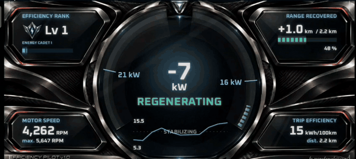
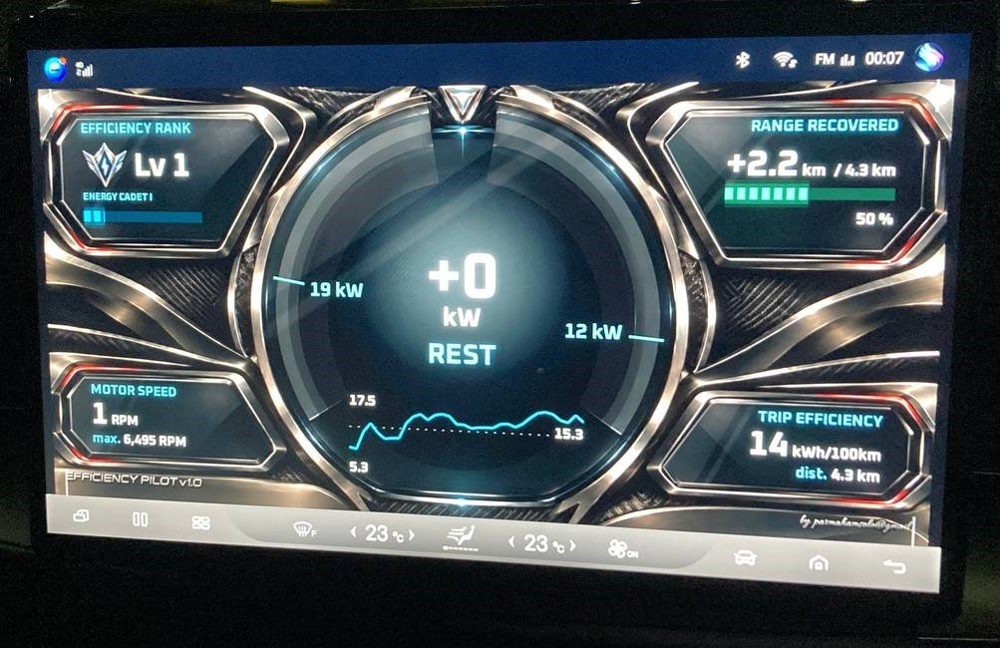

# Efficiency Pilot

**A live efficiency dashboard for the BYD Sealion 7 (DiLink 5).**
Big numbers, live feedback, and a rank to chase. That's it.

  

  <b><a href="../../releases/latest">⬇ Download the latest APK</a></b>
  &nbsp;·&nbsp; Free &nbsp;·&nbsp; No account &nbsp;·&nbsp; No ads

---

## Why this one?

Most EV apps throw a wall of charts at you. Tiny fonts, heavy text, ten graphs you'll never read
while driving.

Efficiency Pilot goes the other way:

- **Simple.** A few big numbers you can read in a glance. Nothing to dig through.
- **Live.** Press the pedal, watch it go red. Lift off, watch it go green. You *feel* what's
  costing you range, the moment it happens.
- **Fun.** Drive smoothly, earn XP, rank up. It turns saving energy into a little game.

The idea: you don't learn efficient driving from a report after the trip. You learn it from
instant feedback while you drive.

## What's on screen

| | |
|---|---|
| ⚡ **Power / regen gauge** | Red = using power. Green = getting energy back. |
| 📊 **Trip efficiency** | Your kWh/100km for this trip. |
| 🔋 **Range recovered** | How many km regen has given back. |
| 📈 **Recent efficiency** | A small rolling line, so you see if you're getting better. |
| 🌀 **Motor speed** | Live RPM, plus your trip max. |
| 🏅 **Efficiency rank** | Your level, title and XP bar. |

Works full screen, or in **split screen** next to your map.

## Screenshots

**Full screen**

**Split screen, next to navigation**

**In the car**

[▶ Watch the clip as a video](media/preview.mp4)

## Ranks & XP

You earn XP as you drive. The more efficient you are, the faster it comes in:

- Drive at **12.5 kWh/100km or better** → **2× XP**
- Average driving → normal XP
- Heavy right foot → you still earn, just slower

Every 550 XP is a level up. Your rank is saved, so it carries over from drive to drive.

Each tier has 10 steps (Energy Cadet I, II, III ... X). Hit Lv 100 and you keep going.

## Will it work on my car?

- ✅ **BYD Sealion 7 with DiLink 5.** Built and tested on this car.
- ❓ **Other BYD models on DiLink 5.** Might work, not tested. Let me know!
- ❌ Phones and other cars. No, it reads data from BYD's own system.

## Privacy

- No account, no ads, no trip history, no location tracking.
- It only **reads** battery, speed and motor data. It never changes a car setting.
- About once a month it checks it's still a supported version. That sends only an anonymous
  install ID and the app version. Nothing else.
  ([details](PERSONAL_USE_NOTICE.txt))

## Install

1. Download `efficiency-pilot-<version>.apk` from **[Releases](../../releases/latest)**.
2. On the head unit, switch to **rotated (vertical) screen mode**.
3. Open **Developer options** and turn on **Wireless ADB debugging**.
4. Install the APK over wireless ADB.

**Updating?** Just install the new APK over the old one. Your rank stays.

## First-time setup (2 minutes, once)

1. Keep **Wireless ADB debugging** on.
2. Open Efficiency Pilot, tap **`...`** (bottom right), then **Allow vehicle access**.
3. The car asks **"Allow USB debugging?"**. Tick **Always allow**, tap **Allow**.
4. The app restarts once. Done, live numbers appear.

Stuck? The Setup screen tells you which step is missing.

## Good to know

- **After the head unit restarts,** the car turns Wireless ADB off. Turn it back on, open the
  app, tap **Connect again** in Setup (often it reconnects by itself).
- **When the car goes to standby,** BYD closes all third-party apps. Just reopen it next drive.

## Quick questions

**Is it safe for my car?**
Yes. It only reads values, it doesn't change anything.

**Why does it need ADB?**
BYD doesn't let normal apps see car data. ADB is how the app gets that access. It resets
every time the head unit restarts.

**Does it cost anything?**
Nope. Free for personal use.

**Where's the source code?**
Not public. This repo is for downloads and updates.

## Stay updated

Click **Watch → Custom → Releases** at the top of this page to get pinged when a new version drops.

## Say hi

Bug, idea, or just your best rank? Email **parmahamsolo@gmail.com**.

---

Free for personal use on your own car. Please don't redistribute, resell, rebrand or reverse
engineer it. See [PERSONAL_USE_NOTICE.txt](PERSONAL_USE_NOTICE.txt). Not affiliated with BYD.
Copyright (c) 2026 parmahamsolo@gmail.com. All rights reserved.
